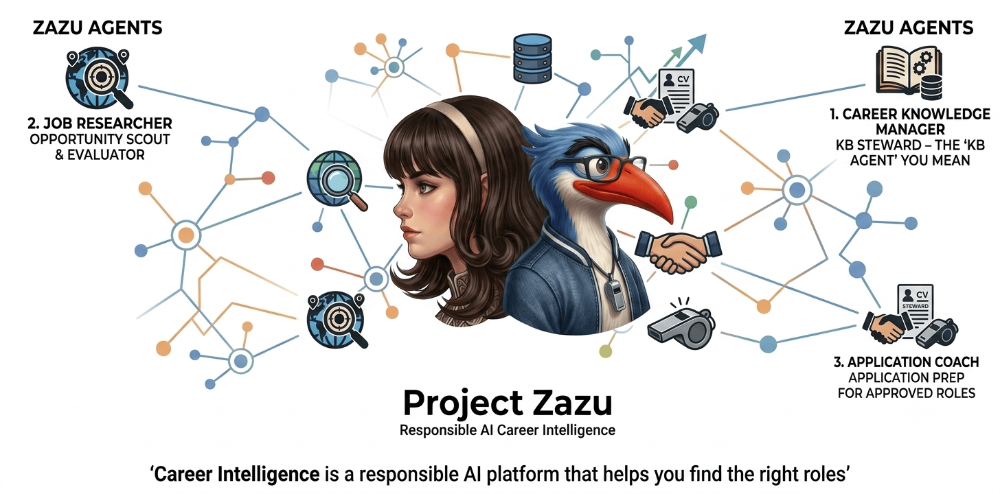
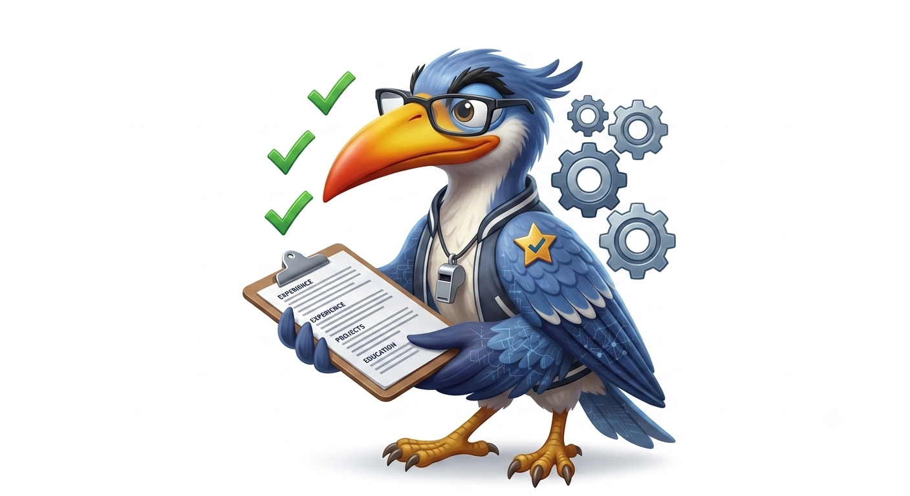

<p align="center">
  
</p>

<p align="center">
  
  <br>
  <strong>Career Intelligence</strong> — responsible AI for your professional journey
  <br>
  Codename: <strong>Project Career Zazu</strong> ·
  <a href="docs/profiles/README.md">Profiles</a> ·
  <a href="agentic/hermes/README.md">Hermes bootstrap</a>
</p>

---

**Career Intelligence** is a responsible AI platform that helps you find the
right roles, prepare truthful application materials, and grow a curated career
knowledge base you control.

This repo is the **Project Career Zazu** Hermes bootstrap — Python +
[Hermes Agent](https://hermes-agent.nousresearch.com/) for **Career Intelligence**.

The previous C# / React **Job AI-sistant** prototype is preserved on branch
`archive/legacy-job-ai-sistant` if you want to dig it out.

```bash
git fetch origin archive/legacy-job-ai-sistant
git checkout archive/legacy-job-ai-sistant
```

---

## What we are building

**Three profiles (not two).** Each maps to a Hermes role with its own tools,
persona (`SOUL.md`), and internet access pattern. **Profile reference** (role,
artifacts, tools, internet): [`docs/profiles/README.md`](docs/profiles/README.md).

<table>
<tr>
<td align="center" width="33%">
  <br>
  <strong><a href="docs/profiles/zazu_knowledge_manager.md">Career Knowledge Manager</a></strong><br>
  <code>zazu_knowledge_manager</code><br>
  <small>KB steward — curates professional history; only writer to the KB (after your approval)</small><br>
  <a href="docs/profiles/zazu_knowledge_manager.md">role · artifacts · tools · internet →</a>
</td>
<td align="center" width="33%">
  <br>
  <strong><a href="docs/profiles/zazu_researcher.md">Job Researcher</a></strong><br>
  <code>zazu_researcher</code><br>
  <small>Opportunity scout & evaluator — Recommendation Reports; read-only KB</small><br>
  <a href="docs/profiles/zazu_researcher.md">role · artifacts · tools · internet →</a>
</td>
<td align="center" width="33%">
  <br>
  <strong><a href="docs/profiles/zazu_coach.md">Application Coach</a></strong><br>
  <code>zazu_coach</code><br>
  <small>Application prep for approved roles — resume, cover letter, Application Brief</small><br>
  <a href="docs/profiles/zazu_coach.md">role · artifacts · tools · internet →</a>
</td>
</tr>
</table>

- [**Job Researcher**](docs/profiles/zazu_researcher.md) answers: *Should I pursue this?*
- [**Application Coach**](docs/profiles/zazu_coach.md) answers: *How do I win this?* (only after you approve)
- [**Career Knowledge Manager**](docs/profiles/zazu_knowledge_manager.md) answers: *What should run next?* and *Is our career knowledge accurate?*

Core principles: human in control, truthful by design, evidence-backed
observations, KB writes only after explicit user approval.

→ Profile index: [`docs/profiles/README.md`](docs/profiles/README.md) ·
Full spec: [`docs/Career_Intelligence_System.md`](docs/Career_Intelligence_System.md)

---

## Repo layout (bootstrap)

```
agentic/hermes/          # Hermes integration — profiles, admin, config
docs/                    # Architecture and onboarding
```

Inspired by the [AI Digest](https://github.com/mameen/AI_Digest) agentic bootstrap
pattern — reference implementation only, not a dependency. Shared agent onboarding:
[`.agents/AGENTS.md`](.agents/AGENTS.md) · [`.agents/onboarding/hermes-and-repo.md`](.agents/onboarding/hermes-and-repo.md).

---

## Agent & contributor docs

| Doc | Purpose |
|---|---|
| [`.agents/AGENTS.md`](.agents/AGENTS.md) | Day-to-day rules — PII, hooks, Hermes redeploy, testing |
| [`.agents/onboarding/hermes-and-repo.md`](.agents/onboarding/hermes-and-repo.md) | **Zazu profiles must read** — repo layout, env, git boundaries |
| [`.agents/README.md`](.agents/README.md) | Layout and reading order |

Hermes `zazu_*` SOULs reference `REPO_ONBOARDING.md` (deployed to `~/.hermes/profiles/` on `setup`).

---

## Getting started

Full machine checklist: **[SETUP.md](SETUP.md)** (venv, pip deps, system OCR).

### 1. Clone and bootstrap

```bash
git clone <your-remote> job-ai-sistant
cd job-ai-sistant

cp .env.example .env
python agentic/hermes/admin/manage.py bootstrap --extract-kb   # venv + pip deps
python agentic/hermes/admin/manage.py setup                    # Hermes profiles + Ollama
python agentic/hermes/admin/manage.py status                   # sanity check
```

`bootstrap --extract-kb` installs both `requirements.txt` and
`requirements-kb-extract.txt` (PDF/DOCX parsing, unstructured OCR). If the venv
already exists after a `git pull`:

```bash
python agentic/hermes/admin/manage.py install-deps --kb-extract
```

### 2. Ollama — point at your host and pull models

Edit **`.env`** (never committed). Two common patterns:

| | Laptop only | Remote GPU + local embeddings |
|---|---|---|
| **Chat** | `OLLAMA_BASE_URL=http://localhost:11434/v1` | `http://192.168.0.100:11434/v1` (LAN host) |
| **Model** | `llama3.1:latest` | `qwen3.6:35b` |
| **Embeddings** | same host | `OLLAMA_EMBED_BASE_URL=http://localhost:11434/v1` |

Chat and embeddings can use **different hosts** — useful when the remote GPU
has your big chat model but not the embedding model.

```bash
# On whichever machine serves each role:
ollama pull qwen3.6:35b          # chat (or your chosen model)
ollama pull nomic-embed-text     # KB RAG embeddings — required for kb-extract
```

Re-run `setup` after changing `.env`:

```bash
python agentic/hermes/admin/manage.py setup
```

See [`.env.example`](.env.example) and
[`agentic/hermes/admin/config/hermes_roles.yaml`](agentic/hermes/admin/config/hermes_roles.yaml).

### 3. Add your career documents (`.kb/`)

Your files live under **`agentic/hermes/.kb/`** — gitignored, stays on your machine.
Bootstrap copies scaffold templates into place; you add the real content.

```
agentic/hermes/.kb/
├── inbox/              drop zone — dump exports, scans, random PDFs/DOCX
├── public/             curated markdown agents read first (resume, skills, …)
├── private/            goals, comp, red/yellow flags, prompts, import originals
│   └── originals/      source DOCX/PDF you keep as templates (e.g. pm-resume.docx)
├── _index/             derived catalog + extracted text (rebuilt by kb-extract)
└── index_db/           ChromaDB RAG index (Ollama embeddings)
```

**You do not need a perfect folder layout.** Drop scattered files in `inbox/` or
any subfolder — `kb-extract` walks the tree, extracts text (basic → unstructured
→ OCR), classifies against the taxonomy, and builds a **RAG index** so agents can
retrieve relevant chunks even when canonical `public/*.md` is thin or missing.
Organize step also drafts `public/master_resume.md`, `skills.md`, etc. from your
best resume sources.

```bash
# Copy your stuff in — examples:
cp ~/Documents/resume.pdf agentic/hermes/.kb/inbox/
cp -r ~/OneDrive/Applications/ agentic/hermes/.kb/private/application_history/

# Index vault → RAG + canonical markdown
python agentic/hermes/admin/manage.py kb-extract --force-organize
```

Optional system OCR for images and scanned PDFs: `brew install tesseract` (macOS).

More detail: [`agentic/hermes/kb/README.md`](agentic/hermes/kb/README.md) ·
[`agentic/hermes/working_agreements_kb.md`](agentic/hermes/working_agreements_kb.md)

### 4. Run it — after bootstrap

**Hello-world job search** (invokes `zazu_researcher` via Hermes; writes
`agentic/hermes/.generated/researched/search_latest.md`). Postings are filtered by
**recency**, not hit count — default **last 10 days** (`--posted-within-days`):

```bash
# default: last 10 days
python agentic/hermes/admin/manage.py search -q "Software Engineering Manager"

# wider window
python agentic/hermes/admin/manage.py search -q "Software Engineering Manager" --posted-within-days 14

# tighter (e.g. only this week)
python agentic/hermes/admin/manage.py search -q "Software Engineering Manager" --posted-within-days 7

python agentic/hermes/admin/manage.py apply --from-search          # DOCX from top CONSIDER hit
python agentic/hermes/admin/manage.py apply --all-from-search --coach --force  # every CONSIDER row + coach
python agentic/hermes/admin/manage.py apply --from-search --coach  # + Application Coach customization
```

**Other useful commands:**

```bash
python agentic/hermes/admin/manage.py kb-scan              # catalog only (no RAG rebuild)
python agentic/hermes/admin/manage.py kb-extract         # full vault → index + RAG
python agentic/hermes/admin/manage.py hermes dashboard     # interactive chat UI
python run_tests.py
```

**Hermes chat** (pick a profile in the dashboard):

```text
EVALUATE_OPPORTUNITY
url: https://jobs.lever.co/example/...
description: |
  <paste job description>
```

Outputs land in **`agentic/hermes/.generated/`** — researched drafts, future
recommendation reports, and (after approval) application DOCX in
`proposals/<YYYYMMDDHHmmss>/`. See
[`working_agreements_generated.md`](agentic/hermes/working_agreements_generated.md).

### Next steps

1. ~~Application registry~~ — SQLite at `.kb/_index/applications.db` (`applications import-vault|list|record-outcome`)
2. Intake adapters as code (`user_direct`, `recruiter_message`)
3. Hybrid BM25 + vector RAG for dedupe enrichment

→ Setup: [SETUP.md](SETUP.md) · Bootstrap: [`agentic/hermes/README.md`](agentic/hermes/README.md)

---

## Status

**Bootstrap ready** — three Hermes profiles, CKM front desk (RFC), KB ingestion + RAG, search/apply pipeline, learning trace.

Design: [docs/rfc/CKM_front_desk.md](docs/rfc/CKM_front_desk.md)

---

## Legacy archive

| Branch | Contents |
|---|---|
| `archive/legacy-job-ai-sistant` | Original WinForms C# app, React prototype, cover-letter prompt generator, SQLite tracking |

---

## License

TBD — prior work used MIT-style terms; new codebase license to be decided.
