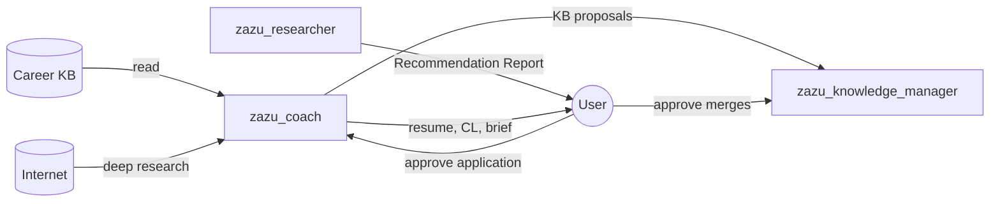

# Application Coach

  

**Hermes profile:** `zazu_coach` · **Question:** *How do I maximize my chances for this approved role?*

[← All profiles](README.md) · [Architecture](../Career_Intelligence_System.md) ·
[SOUL](../../agentic/hermes/admin/config/souls/zazu_coach.md)

------------------------------------------------------------------------

## Role

Activated **only after the user approves** a Recommendation Report. Prepares
truthful application materials, deep company and interview intelligence, and
post-outcome learning proposals — without inventing experience.

------------------------------------------------------------------------

## Interdependencies

| | |
|---|---|
| **Reads from** | Career KB; approved Recommendation Report |
| **Waits on** | User approval of a specific opportunity (from Job Researcher) |
| **Delivers to** | User — application package; KB Manager — learning proposals |
| **Depends on** | Job Researcher output + Career KB; does not re-run fit evaluation |
| **Never writes** | Career KB directly |

------------------------------------------------------------------------

## Outputs & artifacts

| Artifact | When | Consumer |
|---|---|---|
| **Customized Resume** | Per approved role | User (apply) |
| **Customized Cover Letter** | Per approved role | User (apply) |
| **Application Brief** | Per approved role — primary prep doc | User |
| **KB update proposal** | After application / interview outcomes | KB Manager → User approval |

### Application Brief sections

- Opportunity intelligence (role, team, org)  
- Company intelligence (mission, strategy, culture, competitors, news)  
- Interview intelligence (stages, technical focus, behavioral themes)  
- Candidate strategy (STAR stories, weak areas, questions to ask)  
- Compensation notes · Preparation checklist  

Planned schemas:

| Schema | Purpose |
|---|---|
| `application_package/v1` | Resume + cover letter + brief bundle |
| `kb_update_proposal/v1` | STAR stories, wording improvements, observations |

------------------------------------------------------------------------

## Tools

### Hermes toolsets (configured)

| Toolset | Capabilities |
|---|---|
| `file` | Read KB; read Recommendation Report; write drafts to `.runtime/` |
| `web` | Targeted deep research (see Internet) |
| `kanban_worker` | Task completion when orchestrated |

### Planned tools

| Tool | Purpose |
|---|---|
| `read_kb` | Master resume, STAR library, past applications |
| `read_recommendation_report` | Load approved evaluation |
| `tailor_resume` | Select/reorder KB facts — no fabrication |
| `tailor_cover_letter` | Mission/role-aligned letter from KB |
| `build_application_brief` | Assemble prep document |
| `propose_kb_update` | Emit proposal for KB Manager review |
| `web_search` | Company deep-dive, interview experiences |

------------------------------------------------------------------------

## Internet access

**Targeted deep research** — not job-board discovery (Job Researcher scope).

| Use | Examples |
|---|---|
| Company depth | Engineering blogs, annual reports, investor materials |
| People & process | Executive interviews, hiring manager profiles, team pages |
| Interview prep | Public interview experiences, technical talks, recent launches |
| Market context | Earnings calls, competitor news |

| Not primary use | Reason |
|---|---|
| Job board scanning | Job Researcher |
| KB credential validation | KB Manager |

------------------------------------------------------------------------

## Does / does not

| Do | Do not |
|---|---|
| Tailor resume and cover letter from **approved KB facts** | Pursue roles the user has not approved |
| Produce Application Brief with interview strategy | Modify Career KB directly |
| Select relevant STAR stories | Re-run opportunity discovery or fit scoring |
| Propose KB improvements after outcomes | Fabricate experience or inflate qualifications |
| Perform deep company research for **this role** | Bypass Recommendation Report |

------------------------------------------------------------------------

## Career KB access

| Access | |
|---|---|
| Read | ✓ — master resume, STAR stories, history, observations |
| Write | ✗ — proposals only → KB Manager → user approval |

------------------------------------------------------------------------

## Truthfulness rule

Every resume line and cover letter claim must trace to the master resume or
approved KB entry. **Reorder and emphasize — never invent.**
