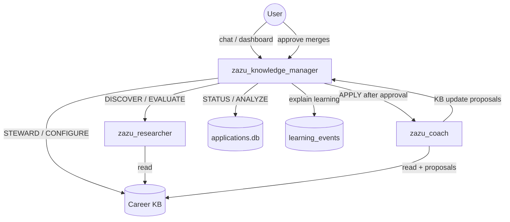

# Career Knowledge Manager

<p align="center">
  
</p>

**Hermes profile:** `zazu_knowledge_manager` · **Questions:** *Is our career knowledge accurate?* · *What should run next?*

[← All profiles](README.md) · [Architecture](../Career_Intelligence_System.md) ·
[RFC: CKM front desk](../rfc/CKM_front_desk.md) ·
[SOUL](../../agentic/hermes/admin/config/souls/zazu_knowledge_manager.md)

------------------------------------------------------------------------

## Role

**Career Zazu front desk** and **Career Knowledge Base steward**.

CKM is the single human-facing entry point: route intents, trigger pipelines,
report status, and maintain an auditable learning trail. It does **not** replace
the Job Researcher or Application Coach — it dispatches them.

> **Not a Concierge profile.** AI Digest keeps `ai_news_concierge`. Career Zazu
> expands CKM instead — same orchestration *pattern*, no second Concierge agent.

------------------------------------------------------------------------

## Interdependencies



| | |
|---|---|
| **Reads from** | Career KB, application registry, learning ledger, kanban (Career partition) |
| **Dispatches** | `zazu_researcher`, `zazu_coach`, deterministic `manage.py` commands |
| **Writes** | KB only after user approval; learning events with explanations |
| **Does not** | Research jobs, write recommendations, write application patches |

------------------------------------------------------------------------

## User intents

| Intent | You might say | Pipeline? |
|---|---|---|
| **DISCOVER** | “Run a search” / daily discovery | Yes → researcher |
| **EVALUATE** | “Check this job” (link, paste, file) | Yes → researcher |
| **APPLY** | “Package Calendly” | Yes → coach (after you approve) |
| **RECORD_OUTCOME** | “Rejected from X” | No → registry + learning trace |
| **ANALYZE** | “Response rate for MCP?” | No → registry topics |
| **STEWARD** | “Scan KB” | Optional → kb-scan |
| **CONFIGURE** | Edit goals, topics, cadence | No → KB proposal |
| **STATUS** | “What’s running?” | No → `career status` |

Design detail: [RFC: CKM front desk](../rfc/CKM_front_desk.md)

------------------------------------------------------------------------

## Trace IDs (learning propagation)

| ID | Purpose |
|---|---|
| `opportunity_id` | Stable per role (`opp:…`) |
| `proposal_run` | Coach output folder `proposals/YYYYMMDDHHmmss/` |
| `search_run_id` | Discovery batch (`search_latest.md`) |
| `learning_event_id` | Explained preference signal (`le:YYYYMMDD:…`) |

Schema: [learning_events_v1.yaml](../../agentic/hermes/schemas/learning_events_v1.yaml)

------------------------------------------------------------------------

## Kanban coexistence (AI Digest + Career Zazu)

One physical Hermes kanban (`~/.hermes/kanban/`). **Logical partitions:**

| Product | Filter | Assignees |
|---|---|---|
| AI Digest | `digest_board_rows` | `ai_news_*` |
| Career Zazu | `career_board_rows` | `zazu_*`, `Career:` titles |

CKM uses `manage.py career status` — never Digest admin tools.

------------------------------------------------------------------------

## Outputs & artifacts

| Artifact | When | Consumer |
|---|---|---|
| Routed pipeline runs | DISCOVER / EVALUATE / APPLY | User |
| STATUS / ANALYZE reports | On request | User |
| Merged KB updates | After user approves | All profiles |
| Learning events | Outcomes, tags, proposals | User, CKM ANALYZE |
| Career Knowledge Health Report | On request | User |

------------------------------------------------------------------------

## Tools

### CLI (CKM orchestration)

```bash
python agentic/hermes/admin/manage.py career status
python agentic/hermes/admin/manage.py career topics
python agentic/hermes/admin/manage.py career learning
python agentic/hermes/admin/manage.py search -q "…"
python agentic/hermes/admin/manage.py apply --coach …
python agentic/hermes/admin/manage.py applications record-outcome --company X --status rejected --topics mcp
python agentic/hermes/admin/manage.py kb-scan [--agent]
```

### Hermes toolsets

| Toolset | Capabilities |
|---|---|
| `hermes-cli` | Dispatch `manage.py` from chat |
| `file` | Read/write KB |
| `web` | Limited validation fetches |
| `kanban_worker` | Complete `Career:` tasks when board orchestration is enabled |

------------------------------------------------------------------------

## Email intake (strong requirement — later)

Forwarded recruiter email/DM → CKM routes **EVALUATE** (`recruiter_message` adapter).
Documented in [working_agreements.md](../../agentic/hermes/working_agreements.md).

------------------------------------------------------------------------

## Does / does not

| Do | Do not |
|---|---|
| Route DISCOVER / EVALUATE / APPLY / STATUS | Produce Recommendation Reports |
| Explain learning with trace IDs | Auto-merge KB without approval |
| Steward KB; merge after approval | Dispatch AI Digest tasks |
| Report from tools and registry | Guess kanban state |
| Tag topics; record learning events | Fabricate metrics |

------------------------------------------------------------------------

## Career KB access

| Access | |
|---|---|
| Read | ✓ |
| Write | ✓ — **only profile** that may persist KB changes |
| Gate | User approval required for every merge |
