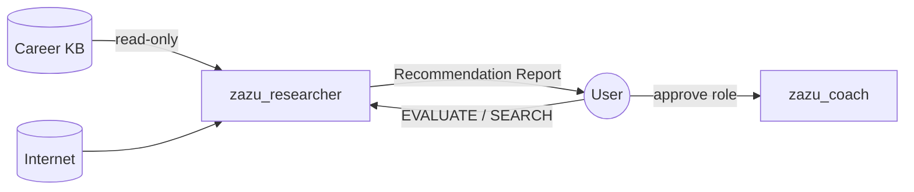

# Job Researcher

<p align="center">
  
</p>

**Hermes profile:** `zazu_researcher` · **Question:** *Should I pursue this opportunity?*

[← All profiles](README.md) · [Architecture](../Career_Intelligence_System.md) ·
[Intake](../../agentic/hermes/working_agreements.md) ·
[SOUL](../../agentic/hermes/admin/config/souls/zazu_researcher.md)

------------------------------------------------------------------------

## Role

Primary **internet-facing scout and evaluator**. Discovers or accepts opportunities
from diverse sources (job boards, ATS pages, chat paste, email, recruiter DMs),
normalizes them, validates authenticity, scores fit against the Career KB, and
produces explainable **Recommendation Reports**.

------------------------------------------------------------------------

## Interdependencies



| | |
|---|---|
| **Reads from** | Career KB (goals, skills, flags, comp targets); user chat; web |
| **Waits on** | User trigger (chat, forward, or discovery run) |
| **Delivers to** | User — Recommendation Report per opportunity |
| **Upstream of** | Application Coach (Coach activates only after user approves a report) |
| **Never writes** | Career KB |

------------------------------------------------------------------------

## Outputs & artifacts

| Artifact | Schema | Consumer |
|---|---|---|
| **Opportunity** (normalized intake) | `opportunity_artifact/v1` | Internal — input to evaluation |
| **Recommendation Report** | `recommendation_report/v1` | User |

Recommendation Report sections:

1. Executive Summary  
2. Recommendation (Apply / Consider / Skip)  
3. Job Summary · Company Snapshot · Authenticity Validation  
4. Why This Fits / Why This Doesn't  
5. Top matching & missing skills · Career growth potential  
6. Red / yellow flags · Compensation estimate · Next steps  

→ Schema: [`opportunity_v1.yaml`](../../agentic/hermes/schemas/opportunity_v1.yaml)

------------------------------------------------------------------------

## Intake modes

All sources → same Opportunity → same report. See
[working agreements](../../agentic/hermes/working_agreements.md).

| Mode | `source_kind` | Examples |
|---|---|---|
| User-directed | `user_direct` | Chat: URL + pasted JD |
| Recruiter message | `recruiter_message` | Email forward, LinkedIn DM |
| Aggregator | `aggregator` | Indeed, ZipRecruiter, Glassdoor |
| Social | `social` | LinkedIn (often paste fallback) |
| ATS / employer | `ats`, `company_site` | Greenhouse, Lever, careers pages |
| Discovery | `discovery` | Search from KB criteria |

Chat template:

```text
EVALUATE_OPPORTUNITY
url: ...
description: |
  ...
message: |
  ...
```

------------------------------------------------------------------------

## Tools

### Hermes toolsets (configured)

| Toolset | Capabilities |
|---|---|
| `file` | Read Career KB; write artifacts to `.runtime/opportunities/` |
| `web` | Page fetch, `web_search` (ddgs) |
| `kanban_worker` | Task completion when orchestrated |

### Planned tools

| Tool | Purpose |
|---|---|
| `intake_opportunity` | Parse chat / email block → `opportunity_artifact/v1` |
| `fetch_job_page` | HTTP fetch + extract (allowlisted hosts) |
| `verify_url` | Link alive / redirect check |
| `web_search` | Company validation, news gap-repair |
| `read_kb` | Goals, skills, flags for fit scoring |

------------------------------------------------------------------------

## Internet access

**Primary internet-facing profile** — broad read access for opportunity and
company surface research.

| Use | Examples |
|---|---|
| Job discovery | LinkedIn, Indeed, ZipRecruiter, company career sites |
| ATS listings | Greenhouse, Lever, Ashby |
| Company surface | Glassdoor, Crunchbase, news, engineering blogs, press |
| Validation | Recruiter legitimacy, posting freshness, scam signals |

| Constraint | |
|---|---|
| Fetch policy | Allowlisted hosts; respect blocks → fall back to user paste |
| Provenance | Record fetched vs `user_pasted` vs `message_body` |
| Write policy | **Never** modify Career KB |

------------------------------------------------------------------------

## Does / does not

| Do | Do not |
|---|---|
| Normalize every source into one Opportunity shape | Write resumes, cover letters, or Application Briefs |
| Produce explainable Recommendation Reports | Modify the Career KB |
| Validate posting and company authenticity | Apply to jobs or contact recruiters |
| Deduplicate opportunities within a discovery run | Activate Application Coach (user approves) |
| Record provenance on every field | Fabricate qualifications or fit |

------------------------------------------------------------------------

## Discovery search (CLI)

`manage.py search` runs the Job Researcher against Career KB criteria. Results go to
`agentic/hermes/.generated/researched/search_latest.md`. The agent is instructed to
include every posting it can verify within the recency window — **not** a fixed hit count.

```bash
# default: last 10 days
python agentic/hermes/admin/manage.py search -q "Software Engineering Manager"

# wider window
python agentic/hermes/admin/manage.py search -q "Software Engineering Manager" --posted-within-days 14

# tighter (e.g. only this week)
python agentic/hermes/admin/manage.py search -q "Software Engineering Manager" --posted-within-days 7
```

------------------------------------------------------------------------

## Career KB access

| Access | |
|---|---|
| Read | ✓ — goals, master resume, skills, flags, comp targets |
| Write | ✗ — read-only |
