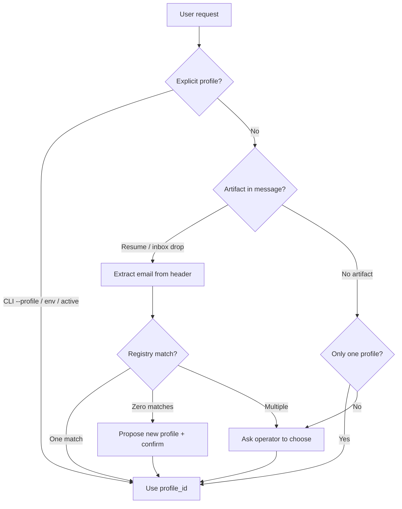

# RFC: Multi-identity Career KB (CKM identity steward)

**Status:** Proposed (future)  
**Product:** Project Career Zazu  
**Date:** 2026-07-09

## Summary

Let **one operator** (you) run Career Zazu for **multiple people** — yourself and
friends — without mixing resumes, RAG indexes, application history, or secrets.

**Career Knowledge Manager (CKM)** becomes the **identity steward**: it resolves
*who an action is for*, maintains a local identity registry, and scopes every
pipeline (`DISCOVER`, `EVALUATE`, `APPLY`, `kb-scan`, …) to a single
**profile vault** under:

```text
agentic/hermes/.kb/<profile_id>/
```

`profile_id` is a **stable, non-reversible identifier** derived from a normalized
primary email — **not** the email itself, and **not** an encryption key.

Sensitive vault content should be **encryptable at rest** (phased). Gitignore and
pre-commit hooks remain mandatory; encryption is defense in depth for a shared
machine or backup disk.

---

## Problem

Today the KB is **single-tenant**:

| Assumption today | Limit |
|---|---|
| Fixed path `agentic/hermes/.kb/` | One career subject per clone |
| RAG + `applications.db` | Built from *your* documents only |
| Coach / Researcher prompts | Assume one resume + goals set |
| Secrets vault | One operator, one mailbox story |

You want to **help friends** (job search, fit, eventually apply) from the **same
install** without cross-contaminating STAR stories, embeddings, or application
state.

You also want CKM to **ask “who is this for?”** when intent is ambiguous, and to
infer identity from artifacts (e.g. email on a resume) when the user says *“find
jobs for the person with this resume.”*

---

## Decision (proposed)

| Topic | Decision |
|---|---|
| Steward | **CKM** manages identities — not a fourth profile |
| Caller context | Active `profile_id` from CLI flag, env, Hermes tool, or CKM disambiguation |
| `profile_id` | `HMAC-SHA256(install_secret, normalize(email))` → url-safe base64url (truncated) |
| Email in paths | **Never** — only `profile_id` directory names |
| Vault layout | `.kb/<profile_id>/public|private|_index|index_db/` |
| Registry | CKM-owned `.kb/_registry/identities.json` (+ optional SQLite later) |
| Aliases | **Later** — multiple emails → one `profile_id` |
| Encryption | **Phased** — see [Encryption](#encryption-phased) |
| Hermes integration | Future **`career identity`** tool shard (resolve / list / set-active) |
| Skill vs role | **CKM responsibility** + thin CLI/Hermes tools; no new agent profile |

This is **operator-mediated multi-subject**, not public multi-tenant SaaS. Friends
do not log into your Hermes; you run pipelines on their behalf with their vault.

---

## Non-goals (for now)

- Hosted multi-user auth, OAuth login, or per-friend Hermes accounts  
- Automatic merge of two profiles when duplicate emails are discovered  
- Encrypting gitignored data that never leaves your laptop (optional early win)  
- Using email hash **as** the encryption key  

---

## Identity model

### Primary key

1. Normalize email: lowercase, strip, punycode domain if needed.  
2. Compute:

   ```text
   profile_id = base64url( HMAC-SHA256( install_secret, "career-profile:v1:" + email ) )[:22]
   ```

3. Store in registry with **non-sensitive hints** only (display name, created_at,
   last_used_at). Never store the raw email in the directory name.

`install_secret` is a random 32-byte value created once at bootstrap
(`agentic/hermes/.runtime/install_secret` — gitignored). It prevents rainbow
tables on email and keeps `profile_id` stable per machine/install.

> **Why not `SHA256(email)`?**  
> Email hashes are enumerable offline if the email is known. HMAC with an
> install-local secret is a standard **pseudonymous ID** pattern.

### Registry (CKM-maintained)

```text
agentic/hermes/.kb/_registry/
  identities.json       # metadata + crypto envelopes (future)
  identities.json.bak   # optional rotation backup
```

Example entry (illustrative):

```json
{
  "schema": "career_identities/v1",
  "profiles": [
    {
      "profile_id": "kR3mP9xQ2vL8nWq1sT0yZa",
      "primary_email_hint": "m***@example.com",
      "display_name": "Mohamed",
      "created_at": "2026-07-09T12:00:00Z",
      "last_active_at": "2026-07-09T12:00:00Z",
      "aliases": [],
      "crypto": null
    }
  ],
  "active_profile_id": "kR3mP9xQ2vL8nWq1sT0yZa"
}
```

- **Hints** mask email for UI; full email lives only in encrypted sidecar or
  operator memory until alias support lands.  
- CKM may write `display_name` from resume header during first ingest.  
- `active_profile_id` is the default for CLI/chat when not specified.

### Aliases (later)

```json
"aliases": ["friend@example.com", "friend.alt@example.org"]
```

All alias emails HMAC to the **same** `profile_id` once linked. CKM proposes
merge; operator approves. Until then, duplicate vaults are possible — acceptable
for v1 friends-only use.

---

## Vault layout per profile

```text
agentic/hermes/.kb/
  _registry/
    identities.json
  <profile_id>/
    inbox/
    public/                 # resume, skills, STAR, projects
    private/                # goals, comp, flags, prompts, history
    private/secrets/        # per-profile OAuth / IMAP vault (existing schema)
    _index/                 # catalog, chunks, applications.db
    index_db/               # Chroma / hybrid RAG
```

**Isolation rule:** `zazu_researcher` and `zazu_coach` receive `profile_id` in
every tool call. No cross-profile RAG, no shared `applications.db`. Violations
are a **privacy incident** — enforce in `paths.py` and tests.

`.generated/` and `.runtime/` should mirror profile scope:

```text
agentic/hermes/.generated/<profile_id>/search_latest.md
agentic/hermes/.runtime/<profile_id>/email_poll_state.json
```

---

## How CKM resolves “who is this for?”



### Resolution sources (priority)

| Priority | Source | Example |
|---|---|---|
| 1 | CLI / env | `manage.py search --profile kR3m…` or `CAREER_PROFILE_ID` |
| 2 | Hermes tool | `career identity set-active …` |
| 3 | CKM active default | `_registry/identities.json → active_profile_id` |
| 4 | Inferred from artifact | Email on resume in `inbox/` or chat attachment path |
| 5 | Disambiguation | CKM asks: *“Who is this for? (you / Jane / new person)”* |

CKM **must not guess** across profiles when more than one exists and confidence
is low. First ambiguous action in a session triggers the question.

### Resume → profile bootstrap

1. User drops `friend-resume.pdf` in chat or `inbox/`.  
2. CKM runs extract (existing kb-extract path) → reads contact email.  
3. Compute `profile_id`; if new, CKM offers: *“Create profile for j***@…?”*  
4. On approval: `bootstrap --profile <id>`, copy scaffold, move resume to
   `public/`, run `kb-scan` scoped to that profile.

---

## Hermes tool shard (future)

Not a new soul — a **CLI + Hermes tool** surface CKM and you can call:

| Command | Purpose |
|---|---|
| `career identity list` | Profiles (hints only) |
| `career identity resolve --email …` | Print `profile_id` |
| `career identity set-active …` | Default for session |
| `career identity create --email … --display-name …` | Registry + scaffold |

Hermes kanban titles gain optional scope: `Career[kR3m…]: DISCOVER …` for
operator clarity on a shared board.

Whether this ships as a **Cursor skill** (“resolve career profile before search”)
or only as `manage.py` subcommands is an implementation detail; the **contract**
is the registry + `profile_id` threading.

---

## Encryption (phased)

### Principle

| Identifier | Role |
|---|---|
| `profile_id` | **Routing** — directory names, registry keys |
| `install_secret` | **Pseudonymity** — HMAC input |
| **DEK** (per profile) | **Encryption** — random 256-bit AES key |
| **KEK** (operator) | **Wraps DEKs** — from passphrase via PBKDF2 |

**Never** encrypt with `profile_id` or `SHA256(email)` alone. Both are low-entropy
or guessable if the email is known.

Reuse the existing [`secrets_vault.py`](../../agentic/hermes/lib/kb/secrets_vault.py)
pattern: AES-256-GCM, PBKDF2-SHA256 (600k iter), per-blob salt + nonce.

### Fast transparent layer (recommended implementation)

**Do not** add FUSE mounts (`gocryptfs`, `encfs`) or a second crypto stack. They are
slow to operate on macOS and are not “simple in code.”

**Do** add one small Python module — e.g. `lib/kb/profile_crypto.py` — on top of
**`cryptography`** (already in `requirements.txt`). Same primitives as the secrets
vault; different file envelope for arbitrary text/binary.

#### Performance model

| Step | When | Cost |
|---|---|---|
| PBKDF2 (600k) → KEK | **Once** at `manage.py career unlock` | ~200–500 ms |
| AES-256-GCM encrypt/decrypt | Every file read/write | **µs–ms** per file |
| DEK in memory | Whole CLI / agent session | 32 bytes |

“Transparent” means: **pay KDF once**, then reads feel like normal disk I/O. Never
derive keys per file.

#### File envelope (`czenc/v1`)

Single-file format — no sidecars:

```text
CZENC1\n
<base64 nonce>\n
<base64 aes-gcm ciphertext + tag>\n
```

Plaintext never hits disk. `kb-scan`, coach, and RAG call **`read_bytes()` /
`read_text()`** on this module instead of `Path.read_text()` for paths under
`private/` (and optionally `public/`).

#### Code surface (target API)

```python
from lib.kb.profile_crypto import session

session.unlock(passphrase)          # once per manage.py invocation (or long REPL)
text = session.read_text(path)      # decrypt if CZENC1, else passthrough (migration)
session.write_text(path, text)      # always encrypt when policy says so
raw = session.read_bytes(path)
```

`manage.py` calls `session.unlock()` at startup when `CAREER_OPERATOR_PASSPHRASE`
is set or after one interactive prompt — same ergonomics as `secrets unlock`.

All KB code paths that today do `path.read_text()` under `.kb/.../private/` get
routed through `session` — **one choke point**, not sprinkled `encrypt()` calls.

#### What to use / not use

| Option | Verdict |
|---|---|
| **`cryptography` AES-GCM** | **Yes** — already shipped; extend `secrets_vault` KDF helpers |
| **[age](https://github.com/FiloSottile/age)** (`rage` / `age` CLI) | **Optional** for manual export/import bundles only |
| **Fernet** | No — fine for tokens; awkward for large markdown |
| **SQLCipher** | Later — only if `applications.db` must be encrypted at rest |
| **macOS Keychain** | Later — store wrapped DEK instead of prompting |
| **FUSE / gocryptfs** | No — ops-heavy, poor fit for agentic tooling |
| **Email hash as key** | **Never** |

#### Optional: `age` for handoff only

Install `age` via Homebrew for **human** operations (“send friend an encrypted zip”):

```bash
age -p -o profile.age < exported.tar
age -d -o exported.tar profile.age
```

Runtime KB I/O stays in Python + `cryptography`; `age` is not on the hot path.

#### Session lifecycle

```text
manage.py career unlock     # derive KEK, unwrap profile DEK(s), cache in process
manage.py kb-scan …         # all private/ reads → profile_crypto.session
manage.py search …          # same process or re-unlock from env passphrase
```

For Hermes long-lived agents: passphrase from env var (like `CAREER_VAULT_PASSPHRASE`)
or unlock at dashboard start — **no per-file prompts**.

#### Migration / plaintext coexistence

`read_text()` detects magic header `CZENC1`:

- Encrypted → decrypt with session DEK  
- Plaintext → return as-is (legacy); `write_text()` encrypts on next save  

Enables rolling migration without a big-bang re-encrypt.

#### Module split (keep it simple)

```text
lib/kb/crypto_primitives.py   # _derive_key, aes-gcm wrap/unwrap (shared with secrets_vault)
lib/kb/profile_crypto.py      # session, read_text, write_text, CZENC1 envelope
```

Refactor `secrets_vault.py` to import primitives from `crypto_primitives.py` when
touching crypto — **one KDF story**, two envelopes (JSON entries vs files).

### Phase 0 — today (acceptable for friends-only delay)

- `.kb/` gitignored + pre-commit scanner (already shipped).  
- Operator passphrase protects **secrets vault only** (`private/secrets/vault.json`).  
- Profile markdown and RAG index are **plaintext on disk**.

### Phase 1 — early privacy win (recommended before friends)

Encrypt **your** profile vault at rest while keeping search usable:

| Content | Encrypt? | Notes |
|---|---|---|
| `private/` markdown | Yes | Goals, comp, flags, history |
| `public/` markdown | Optional | Resume often needed for local RAG — may stay plaintext initially |
| `_index/extracted/` | Optional | Regenerable from vault |
| `index_db/` | No | Rebuild from decrypted extract; or encrypt whole dir as blob |
| `private/secrets/` | Already encrypted | Per existing RFC |
| Registry emails | Encrypted sidecar | `identities.secrets.json` entry per profile |

Unlock once per session: `manage.py career unlock` (same passphrase as vault or
a dedicated `CAREER_OPERATOR_PASSPHRASE`).

### Phase 2 — per-profile DEKs (friends)

```json
"crypto": {
  "dek_wrapped": "<base64>",
  "kdf_salt": "<base64>",
  "schema": "profile_dek/v1"
}
```

- Each profile gets random DEK.  
- DEK wrapped with KEK derived from operator passphrase + per-profile salt.  
- Friend profiles you operate share **your** KEK; friend does not need a login.  
- Optional: export profile as encrypted bundle for handoff to their own install.

### Phase 3 — aliases + rotation

- Re-wrap DEKs on passphrase change (`career rekey`).  
- Alias merge reindexes RAG under one `profile_id`.

---

## CKM behavior changes (future)

| Mode | Addition |
|---|---|
| **Route** | Every intent carries `profile_id`; refuse if unresolved |
| **Steward** | `kb-scan`, learning events, registry CRUD per profile |
| **Explain** | Learning trace includes `profile_id` (not email) |
| **Disambiguate** | One-shot “who is this for?” before DISCOVER/APPLY |

Workers (`zazu_researcher`, `zazu_coach`) stay dumb: they receive scoped paths,
never pick a profile themselves.

---

## Migration from single-tenant

1. On first run after upgrade, migrate `agentic/hermes/.kb/*` →
   `.kb/<your_profile_id>/` using email from `public/master_resume.md` or
   operator prompt.  
2. Write `_registry/identities.json` with one entry; set `active_profile_id`.  
3. Update `paths.py` → `kb_root(profile_id)`.  
4. Existing tests gain a default `profile_id` fixture.

---

## Security & privacy checklist

- [ ] `profile_id` is HMAC-based, not raw email hash  
- [ ] Email never appears in paths, kanban titles, or committed artifacts  
- [ ] Registry stores hints only; full email encrypted or ephemeral  
- [ ] RAG / coach tools assert `profile_id` on every read  
- [ ] Pre-commit + gitignore unchanged  
- [ ] Encryption optional Phase 1 for operator’s own `private/`  
- [ ] Audit log: `learning_events` include `profile_id`  

---

## Open questions

1. **Default profile** — auto-create from operator email on first bootstrap?  
2. **RAG with encrypted public resume** — decrypt-on-scan vs encrypted Chroma?  
3. **Handoff** — export encrypted profile for friend’s separate clone?  
4. **Skill packaging** — Cursor skill that forces `career identity resolve` before
   `manage.py search` in agent sessions?  
5. **Email intake** — per-profile `vault.json` under `private/secrets/` (already
   natural fit).

---

## Related

- [CKM front desk](CKM_front_desk.md) — routing intents; identity gate extends STATUS/DISCOVER  
- [secrets and email intake](secrets_and_email_intake.md) — per-profile secrets vault  
- [`secrets_vault_v1.yaml`](../../agentic/hermes/schemas/secrets_vault_v1.yaml) — crypto pattern to reuse  
- [`paths.py`](../../agentic/hermes/lib/kb/paths.py) — today’s single `kb_root` (migration target)  

---

## Suggested implementation order

| Phase | Scope |
|---|---|
| **A** | RFC + schema stub `career_identities_v1.yaml`; no runtime change |
| **B** | `profile_id` paths + registry + `--profile` on `manage.py` |
| **C** | CKM disambiguation + resume email extract |
| **D** | Phase 1 encryption for `private/` (operator only) |
| **E** | Hermes `career identity` tool shard |
| **F** | Aliases + encrypted registry + friend handoff export |

**A** is documentation-only (this RFC). **B–C** unlock friends job search safely.
**D** is worth doing early even for solo use — same crypto as secrets vault.
