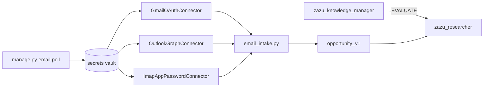

# RFC: Encrypted secrets vault + email intake connectors

**Status:** Accepted (email poll landed)  
**Product:** Project Career Zazu  
**Date:** 2026-07-09

## Summary

Add a **local encrypted secrets vault** for OAuth tokens and IMAP app passwords, plus a
**connector interface** for recruiter email intake (Gmail, Outlook, Yahoo). Credentials
live under `agentic/hermes/.kb/private/secrets/` — **never** indexed by KB scan or RAG.

LinkedIn **passwords are out of scope** — guest aggregators (JobSpy) and ATS boards
remain the default DISCOVER path. Optional `linkedin_session` stores cookies only.

---

## Problem

1. Future **email intake** (`recruiter_message` → `EVALUATE`) needs refresh tokens and
   IMAP credentials without putting them in `.env`, chat, or RAG-indexed markdown.
2. Users asked about encrypting credentials in `.kb` — we need a **safe zone** that
   agents cannot accidentally read into prompts.
3. Providers differ: Gmail/Outlook want **OAuth2**; Yahoo often uses **app passwords**.

---

## Decision

| Topic | Decision |
|---|---|
| Storage | `agentic/hermes/.kb/private/secrets/vault.json` (gitignored with `.kb/`) |
| Encryption | **Symmetric** AES-256-GCM; key from passphrase via PBKDF2-SHA256 (600k iter) |
| Passphrase | `CAREER_VAULT_PASSPHRASE` env or interactive prompt |
| KB scan | **`secrets/` excluded** — never cataloged or embedded |
| Agent access | **No** — only `manage.py` and future `email poll` adapter code |
| LinkedIn login | **No password storage**; optional `linkedin_session` cookie entry |
| Email model | One **`EmailConnector`** interface; provider-specific implementations |
| Intake contract | `InboundMessage` → `opportunity_artifact/v1` (`recruiter_message`) |
| CKM routing | Unchanged — CKM routes **EVALUATE**; connectors are infrastructure |

---

## Vault layout

```
agentic/hermes/.kb/private/secrets/
  README.md          # human instructions (from scaffold)
  vault.json         # encrypted entries (created by secrets set)
```

Schema: [`agentic/hermes/schemas/secrets_vault_v1.yaml`](../../agentic/hermes/schemas/secrets_vault_v1.yaml)

### Entry types (v1)

| Type | Use when |
|---|---|
| `oauth_gmail` | Gmail API / XOAUTH2 IMAP |
| `oauth_outlook` | Microsoft Graph mail |
| `imap_app_password` | Yahoo, generic IMAP |
| `linkedin_session` | Optional logged-in LinkedIn (cookies only) |
| `proxy_list` | Optional aggregator proxies |

Each entry’s **plaintext JSON payload** is encrypted per-entry (unique nonce).

---

## CLI (scaffold)

```bash
# Verify passphrase unlocks vault
python agentic/hermes/admin/manage.py secrets unlock

# List keys (types only — never values)
python agentic/hermes/admin/manage.py secrets list

# Store from JSON file (e.g. OAuth token export)
python agentic/hermes/admin/manage.py secrets set gmail_oauth \
  --type oauth_gmail \
  --from-json ~/Downloads/gmail-oauth.json

# Remove an entry
python agentic/hermes/admin/manage.py secrets delete gmail_oauth
```

Passphrase: export `CAREER_VAULT_PASSPHRASE='…'` or enter at prompt.

---

## Email intake architecture (next phase)



### Provider strategy

| Provider | Preferred | Library direction |
|---|---|---|
| Gmail | OAuth2 + Gmail API | `google-auth`, `google-api-python-client` |
| Outlook / M365 | OAuth2 + Graph | `msal`, Graph REST |
| Yahoo | IMAP + app password | stdlib `imaplib` or `aioimaplib` (async poller) |

**POP** is not a target — IMAP supports unread folders and server-side flags.

### Polling

```bash
pip install -r requirements-email.txt   # Gmail + Outlook; IMAP uses stdlib only

python agentic/hermes/admin/manage.py email poll --vault-key gmail_oauth
python agentic/hermes/admin/manage.py email poll --vault-key yahoo_imap --job-filter
```

Writes `agentic/hermes/.generated/intake/email_poll_<stamp>.json` and
`email_poll_latest.json`. Dedupe state: `agentic/hermes/.runtime/email_poll_state.json`.

CKM routes **EVALUATE** on each opportunity in the latest poll artifact.

---

## Security rules

1. **Never** commit `vault.json` or passphrases.
2. **Never** log decrypted fields or include them in Hermes prompts.
3. Validate entry keys (`^[a-z][a-z0-9_]{1,47}$`) and types against schema allowlist.
4. Prefer **OAuth refresh tokens** over mailbox passwords.
5. Rotate `linkedin_session` before `expires_at`; treat as high-risk optional path.

---

## What scaffold includes vs later

| Landed | Later |
|---|---|
| Schema + RFC | OAuth device-flow helper (`secrets oauth-init`) |
| `secrets_vault.py` + `manage.py secrets` | macOS Keychain for DEK |
| Gmail / Outlook / IMAP connectors + `email poll` | Async IDLE poller / cron template |
| `email_poll` artifacts + dedupe state | Auto-dispatch CKM EVALUATE per message |

---

## Related docs

- [CKM front desk](CKM_front_desk.md)
- [working_agreements.md](../../agentic/hermes/working_agreements.md) — `recruiter_message`
- [opportunity_v1.yaml](../../agentic/hermes/schemas/opportunity_v1.yaml)
